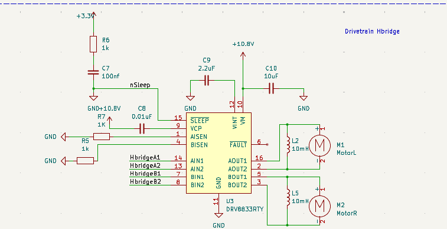

# Yanhao Worklog

[[_TOC_]]

# 2025-09-23 - Discussion about PCB

After Proposal Review of our ant weight battle bot, we start discussing about how to draw these schematics of these modules on PCB, I was assigned to focus mainly on the drivetrain subsystem, namely H-bridge.

# 2025-09-30 - Schematics Updates

I designed the drivetrain subsystem using the dual H-bridge DRV 8833RTY, which can take 10.8 Voltages at maximum.

[link](https://www.ti.com.cn/product/cn/DRV8833)

This means that we need to design buck converters for it: Our raw input is 12 V since we are using 450mah 3s Lipo Battery

We also need to start thinking about integrating different subsystems on our schematics.

