# Yanhao Worklog

# 2025-09-23 - Discussion about PCB

After Proposal Review of our ant weight battle bot, we start discussing about how to draw these schematics of these modules on PCB, I was assigned to focus mainly on the drivetrain subsystem, namely H-bridge.

# 2025-09-30 - Schematics Updates

I designed the drivetrain subsystem using the dual H-bridge DRV 8833RTY, which can take 10.8 Voltages at maximum.

[link](https://www.ti.com.cn/product/cn/DRV8833)

This means that we need to design buck converters for it: Our raw input is 12 V since we are using 450mah 3s Lipo Battery

We also need to start thinking about integrating different subsystems on our schematics.

# 2025-10-09 - Whole Schematics

Getting the microcontroller subsystem schematic and 3.3V buck converters from Mig, I added two more buck converters using LM2596 adjustable version, since 10.8V for Hbridge and 6 V for servo motors are not standard output of voltage regulators.

The choices of resistors and other parameters in designig these buck converters take reference from this:
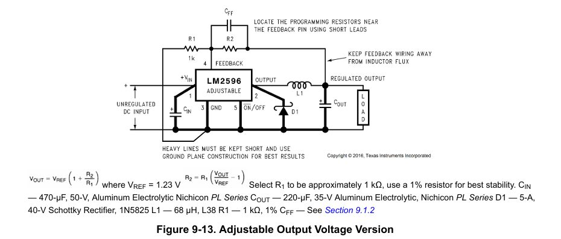

# 2025-10-12 - Complete First Version of PCB

According to the whole schematic, designed the whole PCB and there are some issues when running DRC on it, including isolated islands, hole sizes.
 

# 2025-10-16 PCB Orders Sent

Debugged previous problem by adding vias and rerouting, created second version PCB that fits 100mm*100mm and place orders of it.

# 2025-10-21 BlueTooth Control

To implement the Bluetooth control, I start from implementing and testing out giving command to ESP32 to move backward and forward for this motor 
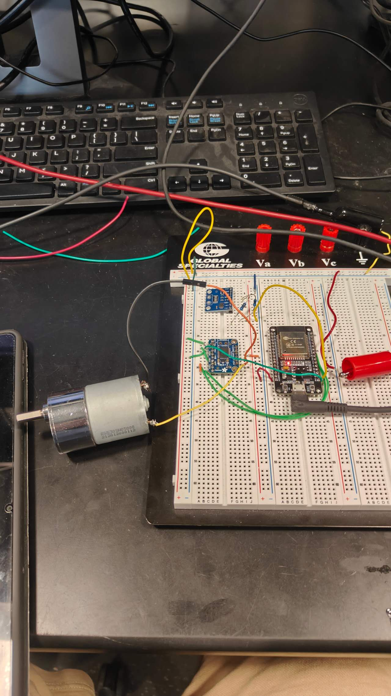

I started with application Bluetooth_Serial_Terminal to give command to ESP32 and uses Arduino code to program the ESP32 Dev Board. To ensure safety of the bluetooth connection, I set up a code that I have to put in before I give any commands. Since ESP32 Bluetooth module doesn't really support code matching,it will automatically connected to any device, I use the code logic that if the first thing I sent after connection is not the password, disconnect automatically. The result looks pretty good

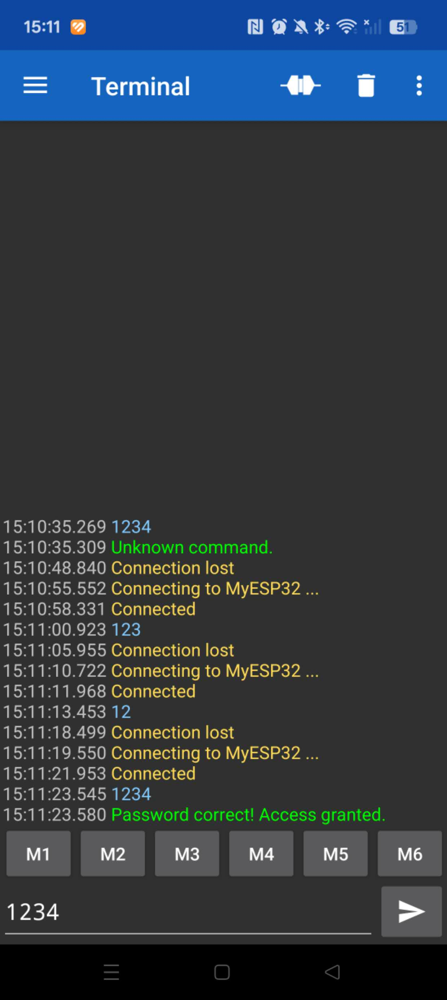

Move Forward and Move Backward implemented successfully:

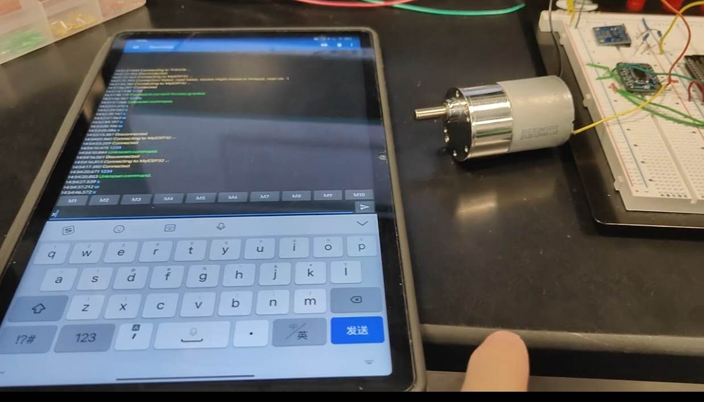

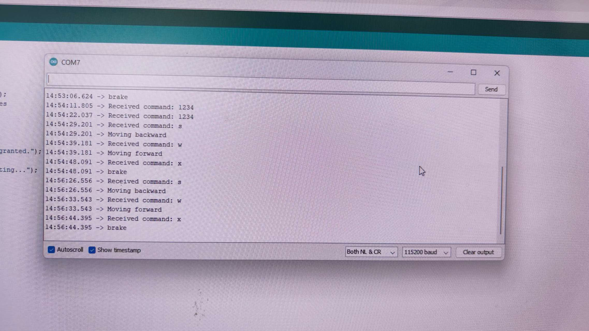

The issue is that the motor keeps moving forward or backward continuously until I send a command to reverse or stop it. I want to control it like a car where, if I don't give any command for a moment, it automatically stops.

# 2025-10-22 BlueTooth Control(Time)

I updated the code to include time-based control. In the loop(), if no meaningful command is received within 300 ms, the system stops automatically. This approach relies on streaming where the ESP32 continuously receives 1-byte commands. However, this makes using a password impossible because any noise can interfere, which is the trade-off for real-time control.

# 2025-11-04 PCB soldering

We got PCB and started soldering it and we noticed that we lack some irregular resistor, capacitors SMD. I put orders through DigiKey
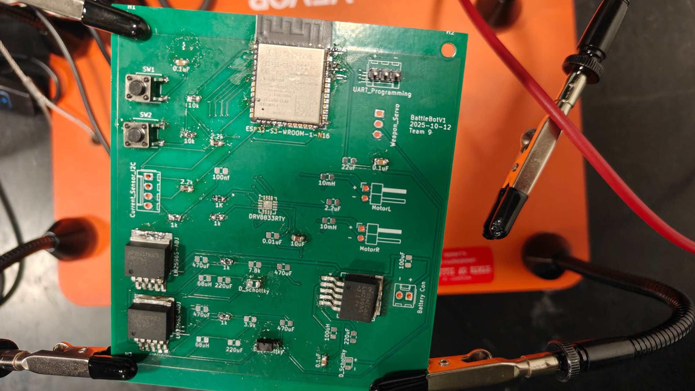

# 2025-11-10 PCB Tested

While some of our ordered components haven't arrived yet, we temporarily replaced them with through-hole versions so we can decide whether to submit a new PCB order for the fourth round. However, our buck converters failed the one intended to output 3.3 V gives 0.1 V, the 10.8 V output gives 12 V, and the 6 V output gives 4.3 V, but with reversed polarity.  
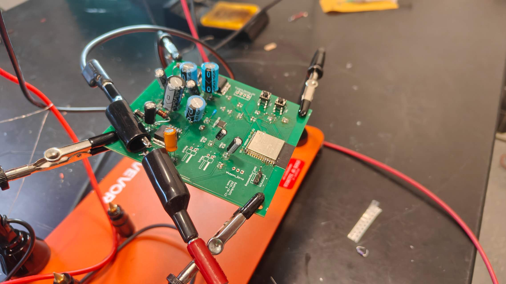
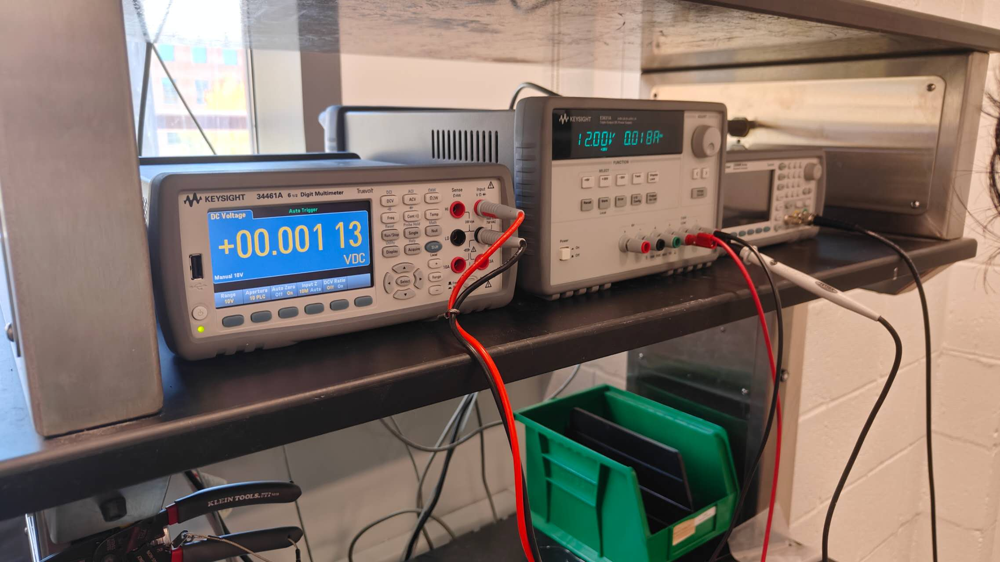
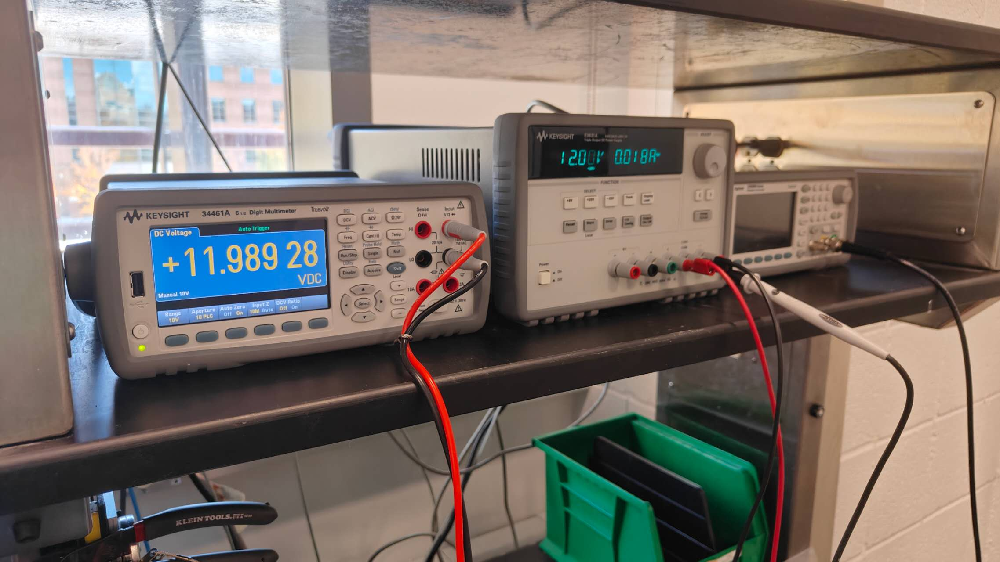
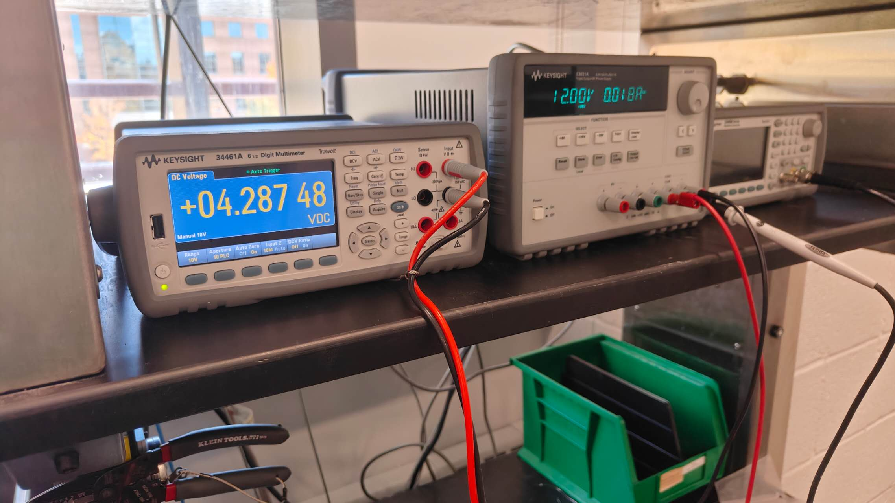

# 2025-11-12 Second PCB Order

Considering the buck converter's failure, I rechecked the datasheet and think I used a capacitor meant for decoupling that was too large in value and polarized. It should be small and nonpolarized. I also removed the H bridge chip and used pins to connect with a mature module because the H bridge is too difficult to solder. Additionally, I left power pins available so if our buck converters don't work, we can use external power to boot and load our ESP32.
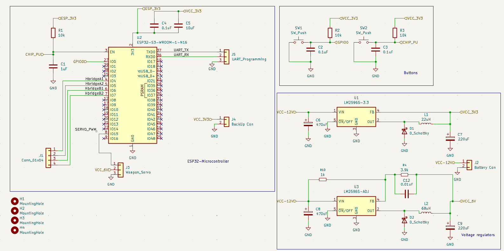

# 2025-11-14 Battery Testing

We obtained an XT30 to JST adapter and a charger for our battery. We started powering the motors and modules on the breadboard using our own battery and tested it by running two wheels for 4 minutes. I believe this duration is sufficient to withstand a competition lasting 2 minutes.
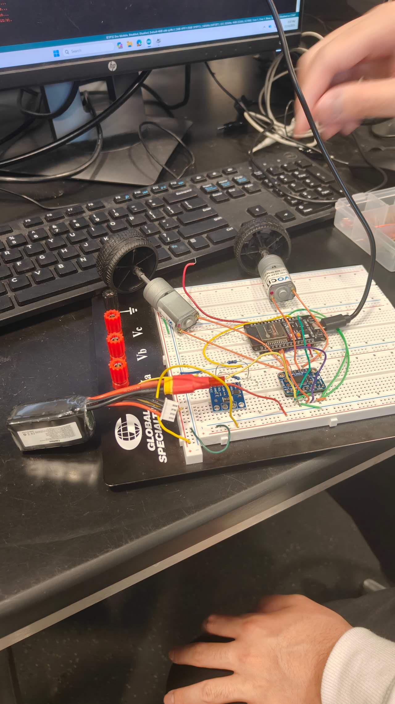
