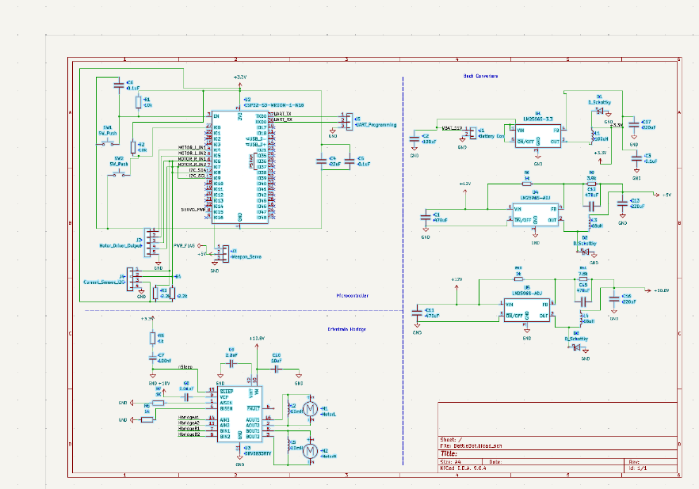
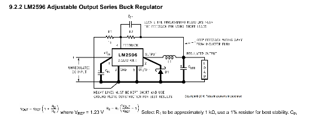
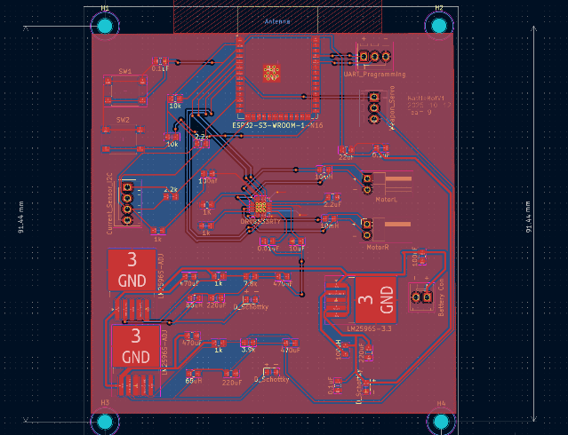

# Yanhao Worklog

# 2025-09-23 - Discussion about PCB

After Proposal Review of our ant weight battle bot, we start discussing about how to draw these schematics of these modules on PCB, I was assigned to focus mainly on the drivetrain subsystem, namely H-bridge.

# 2025-09-30 - Schematics Updates

I designed the drivetrain subsystem using the dual H-bridge DRV 8833RTY, which can take 10.8 Voltages at maximum.

[link](https://www.ti.com.cn/product/cn/DRV8833)

This means that we need to design buck converters for it: Our raw input is 12 V since we are using 450mah 3s Lipo Battery

We also need to start thinking about integrating different subsystems on our schematics.

# 2025-10-09 - Whole Schematics

Getting the microcontroller subsystem schematic and 3.3V buck converters from Mig, I added two more buck converters using LM2596 adjustable version, since 10.8V for Hbridge and 6 V for servo motors are not standard output of voltage regulators.

The choices of resistors and other parameters in designig these buck converters take reference from this:

# 2025-10-12 - Complete First Version of PCB

According to the whole schematic, designed the whole PCB and there are some issues when running DRC on it, including isolated islands, hole sizes.
 

# 2025-10-16 PCB Orders Sent

Debugged previous problem by adding vias and rerouting, created second version PCB that fits 100mm*100mm and place orders of it.

